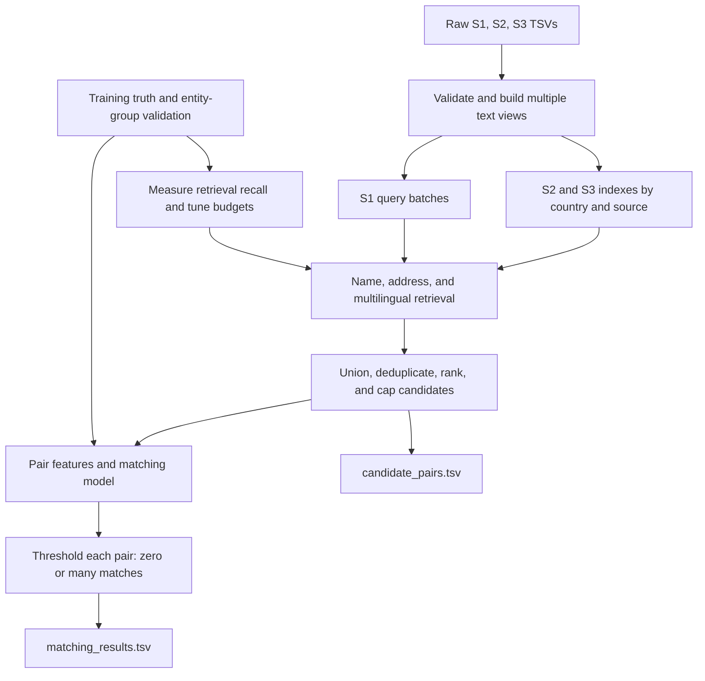

# Business entity resolution: processing, blocking, and modeling strategy

## Recommendation

Build a system with several ways to retrieve candidates, followed by one shared pair-matching model. Start with name/address token and character retrieval plus a LightGBM classifier. Add multilingual embedding retrieval after measuring the lexical baseline's misses. Introduce a neural pair reranker only if it improves held-out macro F0.5 enough to justify its cost.

Blocking is a shortlist generator, not a declaration that everyone in a bucket is the same business. Allow overlapping blocks. For every S1 record, retrieve S2 and S3 candidates separately, union them, remove duplicate candidate IDs, score the pairs, and return zero, one, or many matches. Do not enforce one match per source or a global one-to-one assignment.

## Evidence used and limits

- Reviewed the supplied 5 minute 56 second video's visual slide sequence using frames across its duration and higher-resolution inspection of the blocking and scoring slides. The audio was not transcribed; conclusions attributed to the video here concern its visible material.
- The video around 2:10 explicitly puts both plausible matches and look-alikes into the Acme shortlist. Around 5:00 it emphasizes blocking recall, precision-weighted macro F0.5, and singleton handling. This supports a retrieval-then-decision architecture, not exact equality or unconditional bucket merging.
- The earlier audit covered 50,000 randomly selected training S1 entities and all 172,910 labelled pairs. It found script changes, aliases, missing addresses, address-number changes, same-name/different-entity cases, and state-text differences in a linked Indian example. Those are observations, not exhaustive properties of the full dataset.
- Test inspection includes a new country-stratified sample and a small unlabelled candidate-retrieval demonstration. There is no test ground truth, so no test precision, recall, or confirmed match claims are made.
- Public sources were used only for software/model documentation. No business identity lookup, external address database, or geocoding was used.

## Architecture

The S1 record is the query. The searchable indexes contain only S2 or S3 records. Records may appear in many retrieval lists. You do not need to build all within-bucket pair combinations or compute S2–S3 matches for the required output.

## 1. Establish reliable data and validation first

Read TSVs with an explicit tab delimiter and UTF-8. Keep IDs and text as strings, including empty fields. Check unique source IDs, ground-truth coverage, duplicate IDs within match lists, and references to missing source records.

Explode training truth into `(source1_id, matched_id)` positive edges. A pair is positive only when the target ID appears in that S1's truth row. Keep singleton S1 rows even though they produce no positive edges.

Create fixed train/tuning/final-validation splits before learning normalization dictionaries, training embeddings, mining supervised examples, or training the matcher. An 80/10/10 split by S1 family is a reasonable initial experiment, not a prescribed optimum. All linked variants of a family stay together. If a target ID belongs to multiple S1 rows, group the connected positive component and investigate it rather than silently leaking that record across splits.

Do not put held-out-family records into supervised training as either positives or mined negatives. A label-free validation retrieval index can contain those records: it must, or the held-out queries cannot find their positives. Evaluate against a realistic large target pool including distractors, not only the few known matches of the validation queries.

Use three different datasets for three jobs:

| Dataset | Purpose |
| --- | --- |
| Existing 50-entity variance sample | Inspect preprocessing and regressions on difficult cases |
| A random, grouped training pilot, initially 50,000–100,000 S1 families | Develop retrieval and pair scoring at manageable cost |
| Frozen grouped validation with realistic candidate competition | Select candidate budgets, models, and thresholds |

The variance sample was deliberately selected for coverage. Its accuracy would not estimate competition performance.

## 2. Preserve several representations of each record

Do not overwrite business names or addresses with one aggressively cleaned string. Keep original fields and derive views used for different purposes.

| View | Processing | Purpose and cautions |
| --- | --- | --- |
| Raw | Original name, address, country, ID | Reproducibility and neural inputs; IDs are join keys, not predictive features |
| Unicode-normalized | Normalize Unicode, case-fold, collapse whitespace | Handle case and encoding differences across all three sources |
| Latin-accent-folded | Alternate view without Latin diacritics | Compare `École` and `Ecole`; retain the accented original |
| Name tokens | Preserve word sequence, token counts, and a token-set version | Word reordering and duplication; token-set similarity alone hides repetitions |
| Name without legal forms | Alternate form omitting recognized legal suffixes | Pvt/Ltd/LLC and French SARL/SAS/SASU/SCI/EURL; do not erase them from the raw view |
| Compact/alias name | Optional punctuation-joined initials; extract DBA/formerly aliases and domain stems | Initialisms, trade names, and `.com` strings; no external domain lookup |
| Address tokens | Country-aware abbreviations, token order and token-set views | Road abbreviations, reordering, and incomplete fields |
| Numeric address tokens | Preserve raw tokens and alternate leading-zero-normalized tokens | `0455` vs `455`; avoid destroying distinctions such as `5 bis`, `12/3`, `12A`, or unit numbers |
| Field quality | Missingness, script, length, placeholder and parse-confidence flags | Missing address is lack of evidence, not an address contradiction |
| Embedding input | Field-labelled raw/normalized name and address | Multilingual retrieval; do not rely on this view alone |

Do not remove all Unicode combining marks: that damages Indian-script text. Do not apply a global `st → street` rule to French names/addresses. Do not equate different cities or states based only on a vague similarity. If you learn alias or normalization rules from labelled pairs, use the training fold only and retain uncertainty.

S1 is a deduplicated reference source, not guaranteed clean text. Test S1 already contains decoration such as `<< Team Ecole`, reordered address fields, accents, and `5 bis` address numbers. Normalize S1 too.

For storage, use partitioned Parquet with country/source columns, stable numeric row keys, and a separate mapping back to original entity IDs. Keep field arrays available for fast candidate gathers. Generate expensive pair features in batches rather than storing every possible pair.

## 3. Treat country as a routing field

Use country to select indexes. Build groups from the values that actually occur; never hard-code only US and India. France contains 259,452 test S1 entities, about 15% of test S1.

The audit found no country mismatch among its positive training pairs. Country filtering is therefore a useful starting point, but measure its recall on held-out labels and use a fallback for missing or unreliable labels. A new nonempty country such as France should receive its own index partition, not be dropped as unknown.

Inside a same-country candidate list, a `same_country` feature is constant. Start with a shared matching model using comparison features and source/quality information. Add raw-country effects only if validation supports them; an untrained France category is not a substitute for multilingual handling. There is no need for a model that predicts country or for unsupervised country clustering.

City, state, postcode, and house number may improve ranking or define optional extra blocks, but should not be universal required keys. Our linked Shakti Business example changed house number and state label, and many addresses omit components entirely.

## 4. Generate overlapping candidate sets

For an S1 query `s`, let `C_r,2(s)` and `C_r,3(s)` be candidates returned by retrieval route `r` from each source. The candidate set is the union of those lists, followed by deduplication and a validated budget. Do not require a candidate to pass every route.

| Retrieval route | Implementation idea | What it protects |
| --- | --- | --- |
| Name lexical | Word-token inverted index plus character 3–5 gram retrieval | Typos, accents, punctuation, reordering, partial names |
| Name aliases/initials | Additional compact, legal-form-reduced, acronym, domain-stem and DBA views | `Premio Pharma LLP → PP`, domain-style names, trade aliases |
| Address lexical | Token and character retrieval independently of name | Transliteration, unrelated aliases, damaged names |
| Selective exact/composite keys | Rare name-token combinations, or street-token + numeric-token combinations | Fast high-evidence candidate discovery; never require exact address numbers globally |
| Multilingual dense | Approximate nearest-neighbor search over record embeddings | Different scripts and paraphrased/translated text; benchmark actual recall rather than assuming semantic similarity proves identity |

An address route must be able to retrieve a candidate with poor name overlap. A name route must work when the address is missing. Multilingual retrieval complements these routes; it cannot recover an arbitrary unseen alias with no remaining identifying information by magic.

Use token frequencies to avoid enormous generic blocks such as `India + Private Limited`, `US + LLC`, or a city alone. Downweight common words and retrieve ranked top candidates from large posting lists. Do not expand those blocks into all-pairs comparisons. Character retrieval should use an index or efficient sparse top-k search, not a dense all-record similarity matrix.

**An initial experiment grid:** retrieve around 30 name candidates, 30 address candidates, and 20 dense candidates per target source, then evaluate final budgets of 25, 50, and 100 per source. These are starting values to test, not validated settings. Exact/alias routes contribute additional lists. Use rank fusion rather than directly adding incomparable BM25 and cosine scores. Preserve some capacity for address-only, dense-only, and both-source candidates when capping.

For example, reciprocal-rank fusion adds `1 / (60 + rank)` from each route in which the candidate appears. The constant and route weights are tunable. Missing routes contribute zero. Keep original retrieval scores, ranks, and route membership as model features.

S2 and S3 need separate quotas so one cannot crowd out the other. Deduplicate by target entity ID, not by normalized business text: distinct IDs with identical text may all be valid matches and must remain available. Track pre-cap and post-cap recall. If a K limit loses positives, expand it selectively or improve the responsible retrieval route.

Do not use one exclusive K-means cluster as the sole business bucket. If an ANN index uses vector clusters internally, search multiple nearby clusters and retain independent lexical routes. A record near a cluster boundary should still be retrievable.

## 5. Measure blocking before training a stronger matcher

For each non-singleton S1, compare the retrieved set `C(s)` with the complete true set `T(s)`.

- Micro candidate recall: `sum |C(s) ∩ T(s)| / sum |T(s)|`.
- Macro candidate recall: mean of `|C(s) ∩ T(s)| / |T(s)|` over non-singletons.
- Complete-family coverage: fraction of non-singletons for which every true target was retrieved.
- Zero-hit rate: fraction of non-singletons for which no true target was retrieved.
- Efficiency: mean/p95/p99 candidate count, retrieval time, peak memory, and S2/S3 balance.
- Singleton candidate traffic: how many plausible negatives the matcher must reject for true singletons.

Break these out by country, source, script change, missing address, initialism/alias, name collision, and altered address numbers. The variation flags are diagnostic slices, not verified semantic labels.

Aim initially for approximately 98–99% candidate recall if practical, then inspect which families remain missing and whether the cost is acceptable. This is an engineering target, not a measured result. A strong aggregate number can conceal poor coverage on script changes or missing fields.

Compute an oracle upper bound on macro F0.5 by predicting exactly the positives present in each candidate set and no negatives. This tells you how much score retrieval alone leaves unreachable. Never inject missed true matches into validation candidate sets: that would hide blocking failures. You may add missed positives to matcher training to teach difficult patterns, while separately recording that the retriever missed them.

## 6. Train the first pair-matching model

Train a binary LightGBM model on `(S1, candidate)` pairs. It is a practical baseline because it can combine exact, fuzzy, numeric, missingness, and retrieval evidence. The project is MIT-licensed and supports classification; its suitability for this dataset is a proposal to validate, not a published challenge result. [Official LightGBM project](https://github.com/lightgbm-org/LightGBM).

| Feature group | Example pair features |
| --- | --- |
| Name evidence | Raw/normalized exact match, character similarity, token-set and multiset similarity, rare-token overlap, length ratio |
| Alias evidence | Legal-form-reduced agreement, initials agreement, domain/DBA extracted-view agreement |
| Address evidence | Character/token similarity, containment, rare address-token overlap, parsed locality agreement and parse confidence |
| Numbers | Digit-set overlap, raw/normalized house-number agreement when confidently parsed, unit differences, numeric conflict indicators |
| Multilingual evidence | Name/record embedding cosine, script agreement, script change flag |
| Quality | Missing name/address flags, name/address lengths, placeholder presence, number of surviving informative tokens |
| Retrieval context | Source S2/S3, per-route rank/score, route membership, number of routes that retrieved the candidate |

Use all training positives and mine difficult negatives from the same retrieval pipeline. Examples include the same name at another address, a shared address with a different business, similar names, and close embedding neighbors. Preserve singleton queries and their retrieved negatives. Easy random negatives alone will make training metrics look good while failing on real shortlists.

For a pilot, keep perhaps 20–50 mined negatives per S1, with a small random-negative component; retain more only when necessary. If negatives are subsampled, choose thresholds on an unsampled held-out candidate distribution, not the artificially balanced training set. Consider query/family weighting so one S1 with a huge candidate list does not dominate; validate the weighting choice.

The same model can initially score S2 and S3 pairs, with source as a feature. Try source-specific calibration only if enough validation evidence supports it. Avoid memorizing ID digits or whole entity IDs.

## 7. Add multilingual modeling where it demonstrably helps

A reasonable embedding baseline is `intfloat/multilingual-e5-small`: its published card lists MIT licensing and multilingual support, and its configuration uses 384-dimensional representations. It is a candidate to benchmark for names/addresses, not an established solution for entity resolution. Use the card's symmetric-task prefix convention (`query: ` on both sides) and normalized embeddings consistently. [Model card](https://huggingface.co/intfloat/multilingual-e5-small/blob/main/README.md), [configuration](https://huggingface.co/intfloat/multilingual-e5-small/blob/main/config.json).

Begin with one labelled record-text view, such as `name: ... address: ...`, alongside independent lexical name and address indexes. If analysis shows one field dominates the dense representation, test separate name-only and address-only embeddings; account for the extra storage and encoding cost.

Fine-tune retrieval on training positive families and hard negatives only after measuring the off-the-shelf baseline. A family can have multiple positive records: do not accidentally use another member of that family as an in-batch negative. Rebuild or version indexes when the encoder changes. Re-test held-out-country transfer after fine-tuning so US/India adaptation does not silently destroy broader language performance.

The general retrieve/rerank pattern is supported by Sentence Transformers' documentation. A cross-encoder jointly reads a pair and can refine ranking, but running it on all possible record pairs is impractical. For this task, reserve an optional small multilingual pair model for difficult candidate pairs or a carefully validated reranking stage. [Retrieve and rerank documentation](https://www.sbert.net/examples/sentence_transformer/applications/retrieve_rerank/README.html).

Do not train a large generative model first. If using a pretrained checkpoint, record its exact revision and verify it meets the challenge's model size/license restrictions. A model's embedding similarity is not a calibrated probability that two businesses are identical.

## 8. Select final matches using the actual competition metric

For a candidate `c`, score `p(s,c)` and decide each pair independently using a threshold selected on held-out queries. Return all accepted candidates, even if several are from the same source. Return an empty list when none passes. Do not apply a softmax that forces the candidates to sum to one or always return the top result.

For a nonempty true set, compute the official score using:

`F0.5(s) = 1.25 TP / (1.25 TP + 0.25 FN + FP)`.

If the true set is empty, the score is 1 when the prediction is empty and 0 otherwise. Average over S1 entities, not over pairs. A false negative includes a true match missed during blocking. Tune the whole retrieval-plus-matcher pipeline against this metric. The video's informal cost wording is not a substitute for implementing the formula and singleton rule exactly.

Start with one global threshold, then test limited source/quality-specific thresholds only if they improve independent validation. Do not invent a France-specific threshold from unlabelled test records. Inspect precision, recall, singleton false-positive rate, and score by failure slice alongside macro F0.5. Never use the small variety sample to select the final threshold.

## 9. Handle the France shift explicitly

Training has US and India only. France has legal-form tokens such as SARL, SAS/SASU, SCI, and EURL; accents; abbreviations such as `R.` and `AV`; compound locality names; and number suffixes such as `bis`. The test sample also shows missing addresses and already-noisy S1 records.

Keep generic character-based retrieval and comparison features, preserve raw accented text, use country-aware optional views, and test a multilingual encoder. Do not require one parsed state/region schema to work everywhere. A region label and another administrative label should not be treated as a verified geographic mismatch without reliable parsing.

As a stress test, train on one training country and evaluate on the other, in both directions. This does not estimate France accuracy, but it exposes reliance on familiar country-specific words. Test data can inform label-free schema/format checks; it cannot provide verified matches or labels for threshold optimization.

## 10. Engineer for the actual scale

There are 1,732,544 test S1 queries and 9,969,589 S2+S3 target records. Country filtering reduces the theoretical full comparison count by about 61%, but still leaves roughly 6.72 trillion pairs. Never form that cross join.

| Total candidates per S1 across S2 and S3 | Test pair count | Storage for 50 float32 features alone |
| ---: | ---: | ---: |
| 50 | 86,627,200 | 16.14 GiB |
| 100 | 173,254,400 | 32.27 GiB |
| 200 | 346,508,800 | 64.54 GiB |

One 384-dimensional vector per target takes about 7.13 GiB in float16 or 14.26 GiB in float32 before index overhead and metadata. Additional name/address views multiply that storage. Float16 storage does not imply every chosen ANN index operates on float16 internally.

The current machine reports approximately 31 GiB total RAM and 68 GiB free disk. A GPU query failed because the NVIDIA driver was unavailable to the session; GPU capacity is not verified. This favors a CPU lexical baseline first, with country/source partitions, chunked embedding generation later, and modest batches of perhaps 500–5,000 S1 queries. Benchmark actual throughput before committing to a full dense or neural run.

Use memory-mapped vectors and compact numeric ID mappings. Process one country/source index at a time where useful, then merge ranked results. Benchmark HNSW when memory allows or a compressed IVF/PQ index when memory is tighter; tune search parameters against known-label retrieval recall. Index compression can lose candidates and must be measured. [Official Faiss index guidance](https://github.com/facebookresearch/faiss/wiki/Guidelines-to-choose-an-index).

Keep the pair-ID/score stream separate from the record table. Gather fields, compute features, score, and release a batch. Do not materialize hundreds of millions of wide text rows or full feature rows in one pandas DataFrame. Do not score a single candidate by launching a separate model call; batch inference.

## 11. Produce auditable submission outputs

- `matching_results.tsv`: exactly one row for every test S1 ID, with `source1_entity_id` and comma-separated `matched_entity_ids`; empty when no match is accepted.
- `candidate_pairs.tsv`: exactly one row for every test S1 ID, with `candidate_entity_ids` equal to the deduplicated final shortlist actually supplied to the matching model, after blocking and budget caps. Preserve empty candidate lists.
- Every predicted match must be a valid S2/S3 ID present in that S1's exported candidate list. Do not include S1 IDs as candidates.
- If you later change the matching architecture, make the candidate export point explicit: export the actual input to the matching stage, not an earlier discarded retrieval pool or only the accepted matches.
- Run `student_resource/utils/validate_submission.py` with the correct test directory and output paths. Its format checks do not measure prediction quality.

## 12. Implementation order and decision gates

| Step | Deliverable | Advance when |
| --- | --- | --- |
| 1 | Deterministic preprocessing, source tables, truth edges, grouped splits, exact metric | IDs, Unicode, empty fields, groups, and scoring tests pass |
| 2 | Name/address lexical indexes and candidate export | Candidate recall, complete-family coverage, and costs are measured on realistic target pools |
| 3 | Pair features and LightGBM baseline | End-to-end macro F0.5 and singleton errors are measured on frozen validation |
| 4 | Failure analysis and extra alias/multilingual routes | Added routes improve missing slices without unacceptable candidate growth |
| 5 | Optional retriever fine-tuning or neural reranker | Improvement persists on independent validation and country-transfer stress tests |
| 6 | Batching, checkpointing, full inference, official-format validation | All S1 IDs are present, candidate lineage is reproducible, and every match is a candidate |

Suggested modules are `prepare_records.py`, `make_splits.py`, `build_indexes.py`, `retrieve_candidates.py`, `pair_features.py`, `train_matcher.py`, `evaluate_pipeline.py`, and `predict.py`. These are proposed implementation boundaries, not scripts already implemented by this analysis.

The first useful modeling milestone is a measured lexical-retrieval + LightGBM baseline. Improve the stage responsible for the error: missing true candidate → retrieval; present candidate rejected → matcher/threshold; wrong candidate accepted → features, hard negatives, or threshold. If both name and address lack distinguishing information, preserve uncertainty and favor an empty result over a forced match.

## Test inspection results

The companion files under `analysis/test_review/` contain the raw sampled records, six S1 retrieval queries, illustrative test candidates, and inspection metadata. Their scores are simple token-overlap demonstration scores, not trained model probabilities. No test candidate is asserted to be a true match.

The new inspection sampled 30 records per source/country combination: 270 records across S1/S2/S3 and US/India/France, using seed 2026. This is a balanced inspection sample, not a population-frequency estimate. Six S1 queries, two per country, were selected from it. Both full test target files were scanned for this small demonstration, retaining five candidates per source per query, for 60 candidate pairs.

The demonstration uses normalized informative name/address token overlap, with `max(name_overlap, address_overlap) + 0.5 * min(name_overlap, address_overlap)` as an illustrative ranking score. It removes a short generic-word list and requires a shared informative token for candidate consideration. Its scores can exceed 1, are not probabilities, and its limited lexical rules can miss script-changing or alias matches. It is not an implementation or evaluation of the full proposed retrieval system.

| S1 query | Retrieved test candidate | Observation and modeling implication |
| --- | --- | --- |
| S1-117364976: Amicale de Internationale; 9 RUE de Feltre, Nantes, Pays de la Loire | S2-549354581: Amicale dê Internationale; 9 R DE FELTRE, NANTES, Pays de la Loire | Strong textual evidence despite accent and road abbreviation differences; a useful candidate, not a confirmed label |
| Same S1 | S2-983334973: Amicale des Intèrnationale SCI; 14 RUE AUGUSTE RENOIR, SAINT-NAZAIRE, Pays de la Loire | Very similar name but different street/city; the matcher needs address-conflict evidence |
| S1-146655270: Union de Sages; Lège-Cap-Ferret, Nouvelle-Aquitaine, 10 Rue des Marins | S2-548466255: Union de Sages; 10 R. DES MARINS, LÈGE-CAP-FERRET, Gironde | Shared street/locality but different administrative text; exact region-string blocking would discard it |
| Same S1 | S2-48768050: Sages (France) Union SARL; 132 ALL DES GLACIS, DUNKERQUE, Nord | A generic-name look-alike is also retrieved; name-only confidence would be unsafe |
| S1-23352831: Delhi Software Private Limited; B-207, Anand Lok Society Mayur Vihar… | S2-567532553: DELHI SOFTWARE PRIVATE; B-##207, ANAND LOK SOCIETY MAYUR VIHAR… दिल्ली | Legal-form, punctuation, repetition, and script differences within otherwise strong textual agreement |
| Same S1 | S2-182583370: Delhi Limited Software; B-210, ANAND LOK SOCIETY MAYUR VIHAR… | Number disagreement is useful evidence, but training shows numbers can be corrupted, so it should not be a universal veto |
| S1-11211886: Culbertson Fresh Grupo LLC; 2189 2909, Canton, TX | S2-880901107: Culbertson Fresh Grupo; empty address | A name-only route is required to retain such a candidate; missingness is not a location mismatch |
| S1-143903052: Montalvo and Arnold Future PLLC; 25514 Mountain Drive, Arlington, WA | S2-845668986: M0ntalvo and Arnold Future PLLC; 25514 MOUNTAIN DR, BRYANT, WA | Digit/letter, abbreviation, and locality differences coexist |
| Same S1 | S3-262739051: Montalvo ánd Arnold Future PLLC; 14 Old Maple Court, Essex, Maryland | Similar name with very different address/state; demonstrates the kind of ambiguity the final model must evaluate |

The last row does **not** establish a cross-state positive match: test labels are unavailable. Likewise, shared street text does not prove identity. These examples show what enters a shortlist and why a learned decision is needed.

The sample contains accented French names and Indian-script names, empty addresses, and embedded null markers. Earlier direct inspection also found `S1-921369899` with `5 bis Rue Pierre Dignac` and `S3-643284918` with an empty French address. Preserve informative number suffixes and provide a missing-address route for every country.
